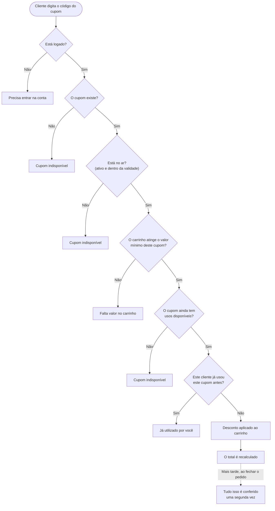

[← Voltar ao índice](./README.md)

# Cupons de desconto

**Em uma frase:** o cliente digita um código, o sistema confere cinco coisas antes de aceitar, e o desconto aparece no carrinho — mas tudo é conferido de novo na hora de fechar o pedido.

## O caminho

## As regras

**Cupom exige estar logado.** É a única coisa no carrinho que pede conta. O motivo: o sistema precisa saber quem é a pessoa para garantir que ela use o cupom uma vez só. Sem identidade, não há como contar.

**Cada cliente usa um cupom uma única vez.** Mesmo que o cupom ainda tenha usos sobrando, quem já usou não usa de novo.

**O cupom pode ter um limite total de usos.** Por exemplo, "vale para os primeiros 100 pedidos". Quando esgota, ninguém mais consegue aplicar.

**O cupom pode ter um valor mínimo de carrinho.** É diferente do valor mínimo do pedido: um é uma regra do cupom, o outro é uma regra do bar. Os dois podem existir ao mesmo tempo.

**O cupom tem data de início e, opcionalmente, de fim.** Fora dessa janela ele não funciona, mesmo que o código esteja correto.

**O desconto pode ser fixo ou em porcentagem.** "R$ 10 de desconto" ou "10% de desconto". Em nenhum caso o desconto passa do valor dos produtos — não existe carrinho com total negativo. A taxa de entrega não entra na conta da porcentagem.

**Tudo é conferido de novo ao fechar o pedido.** Esta é a regra mais importante e a menos óbvia. Entre aplicar o cupom e finalizar a compra pode passar muito tempo: o cupom pode ter expirado, alguém pode ter pego a última unidade disponível, ou o bar pode tê-lo desativado. Por isso a validação inteira roda mais uma vez, e o pedido pode ser recusado mesmo com o desconto já aparecendo na tela.

**Desativar um cupom o retira dos carrinhos.** Quando o bar desativa um cupom, ele desaparece de todos os carrinhos que o tinham aplicado — ninguém fica com um desconto que não vale mais.

**O uso só conta quando o pedido é fechado.** Aplicar o cupom no carrinho não "gasta" ele. E se o pedido for cancelado depois, o uso é devolvido: o cliente pode usar aquele cupom outra vez.

## Quando não dá certo

| Situação | O que a pessoa vê |
|---|---|
| Tentou aplicar um cupom sem estar logada | *"Faça login para utilizar um cupom"* |
| O código não existe, está fora da validade, está desativado, ou esgotou | *"Cupom indisponível"* |
| O carrinho está abaixo do mínimo exigido pelo cupom | *"O valor do carrinho não atinge o mínimo para este cupom"* |
| Ela já usou esse cupom em um pedido anterior | *"Você já utilizou este cupom"* |
| Tentou remover um cupom quando não havia nenhum aplicado | *"Nenhum cupom aplicado ao carrinho"* |
| Ao **fechar o pedido**, o cupom esgotou nesse meio-tempo | *"Este cupom atingiu o limite de uso"* |

> Note que quatro situações diferentes mostram a mesma mensagem — *"Cupom indisponível"*. É proposital: dizer "esse cupom expirou ontem" ou "esse cupom já esgotou" entrega informação sobre campanhas para quem está tentando adivinhar códigos.

---

**Próximo passo:** [fechar o pedido](./pedido.md), onde o cupom é conferido pela última vez.
