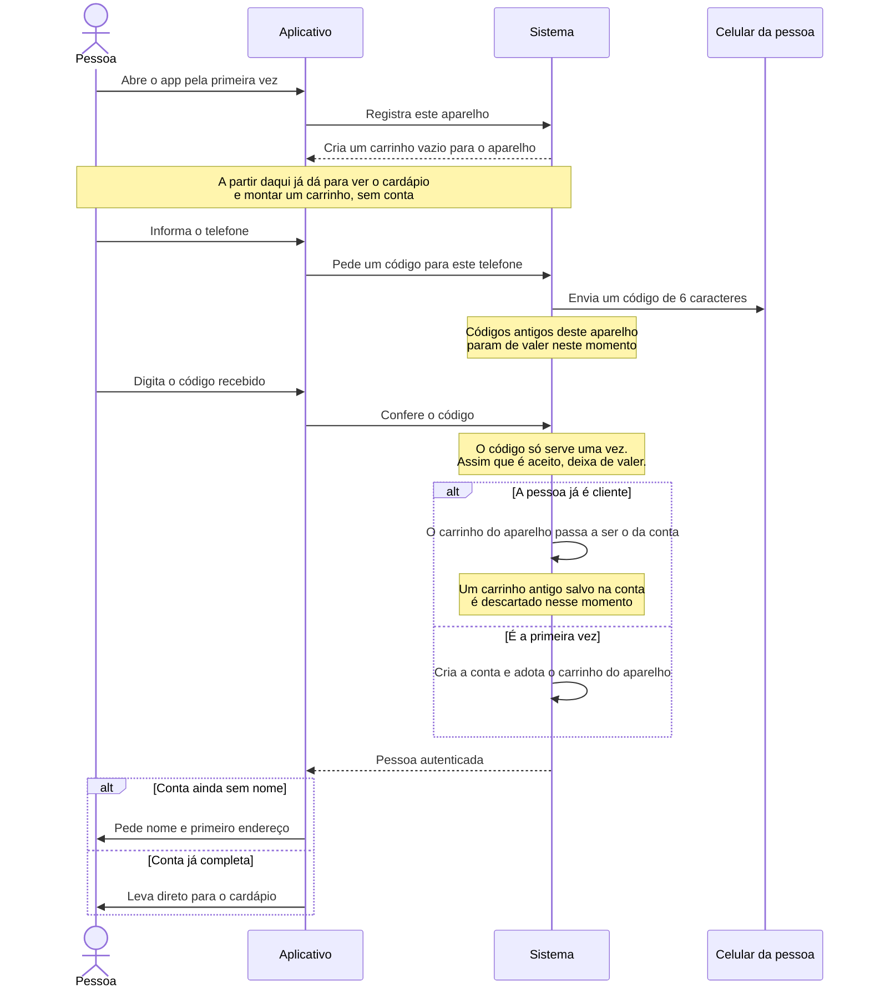

[← Voltar ao índice](./README.md)

# Entrar e criar conta

**Em uma frase:** dá para usar o app sem conta nenhuma; quando a pessoa decide fechar um pedido, ela informa o telefone, recebe um código, e vira cliente — sem senha em momento algum.

## O caminho

## As regras

**Não existe senha.** A identidade é o número de telefone, e a prova é o código que chega nele. Isso evita que alguém precise lembrar de uma senha para pedir uma cerveja, e evita que o bar guarde senhas.

**O código tem 6 caracteres e vale por 5 minutos.** Ele não usa a letra "O" nem o número "0", justamente porque as pessoas confundem os dois ao digitar.

**Cada código serve uma única vez.** Assim que é aceito, deixa de valer imediatamente. Pedir um código novo também invalida o anterior — só o mais recente funciona.

**O carrinho montado antes do login não se perde.** Ele vira o carrinho da conta. Em compensação, se a conta já tinha um carrinho de uma sessão anterior, esse antigo é descartado — vale o que a pessoa acabou de montar.

**A primeira vez pede nome e endereço.** Sem isso não dá para fechar pedido: o bar precisa saber para quem entregar e onde.

**Há limite de tentativas.** Não dá para pedir códigos em sequência nem ficar chutando o código de outra pessoa. Por padrão: um pedido de código a cada 20 segundos, no máximo 5 por hora, e no máximo 10 tentativas de digitar o código a cada 10 minutos. É o que impede alguém de usar o app para disparar mensagens de graça ou invadir a conta alheia por força bruta.

**A sessão se renova sozinha.** A pessoa não precisa entrar de novo a cada vez. Se o sistema detectar que alguém tentou reaproveitar uma sessão antiga, ela é derrubada por segurança.

**Sair do app desconecta as notificações.** Ao sair, aquele aparelho para de receber avisos de pedido.

## Quando não dá certo

| Situação | O que a pessoa vê |
|---|---|
| Digitou um código errado, ou o código já expirou, ou já foi usado | *"Código de verificação inválido ou expirado."* |
| Pediu códigos demais, ou errou o código muitas vezes seguidas | *"Muitas tentativas. Aguarde um momento e tente novamente."* |
| O app perdeu o registro do aparelho | *"Cliente não encontrado para o dispositivo fornecido."* |
| A sessão expirou de um jeito que o app não conseguiu renovar | *"Acesso negado. O token de atualização fornecido é inválido."* |

---

> ⚠️ **Situação atual do envio:** o envio da mensagem de texto ainda não está implementado. Hoje o código é apenas registrado no console do servidor, não chega no celular. É necessário integrar um serviço de SMS antes de colocar no ar.

**Próximo passo:** com a conta criada, a pessoa parte para [montar o carrinho](./montar-carrinho.md).
