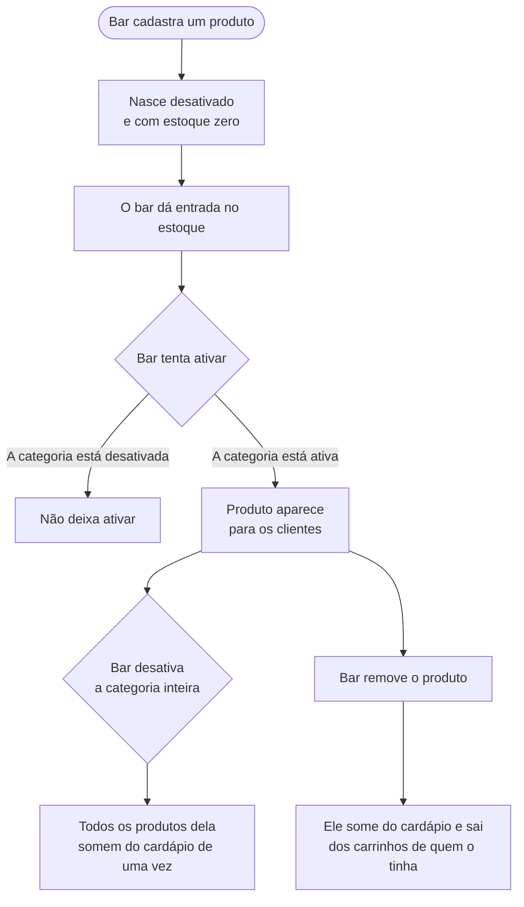

[← Voltar ao índice](./README.md)

# Gestão do bar

**Em uma frase:** o outro lado do aplicativo — onde o bar monta o cardápio, controla o estoque, acompanha os pedidos, cria cupons e decide quando está aberto.

## O cardápio

O cardápio tem dois níveis: **categorias** (Cervejas, Petiscos, Destilados) e, dentro delas, os **produtos**.

**Nada nasce visível.** Produtos e categorias são criados desativados. O bar cadastra com calma, dá entrada no estoque, confere, e só então publica. Um produto novo nunca aparece pela metade para o cliente.

**Desativar a categoria esconde os produtos dela.** É o jeito rápido de tirar "Destilados" do ar sem mexer em cada garrafa.

**Não dá para publicar um produto dentro de uma categoria desativada.** Ele ficaria invisível de qualquer jeito — o sistema avisa em vez de deixar o bar achar que publicou.

**Remover um produto o tira dos carrinhos.** Quem já tinha adicionado não descobre só na hora de pagar.

**Categoria com produto não pode ser apagada.** Primeiro o bar move ou remove os produtos. Isso evita apagar um pedaço do cardápio sem perceber.

**Cliente com histórico de pedidos não pode ser apagado.** Se o bar quer impedir alguém de comprar, o caminho é bloquear a conta, não apagá-la — os pedidos antigos precisam continuar existindo.

**A ordem do cardápio é manual.** O bar define a sequência em que categorias e produtos aparecem.

## O estoque

**Todo movimento de estoque fica registrado.** O sistema guarda um histórico de todas as entradas e saídas, e cada uma diz de onde veio:

| Motivo | Quando acontece |
|---|---|
| Pedido criado | Um cliente fechou um pedido — saída |
| Pedido cancelado pelo cliente | O cliente desistiu antes do preparo — entrada |
| Pedido cancelado pelo bar | O bar cancelou — entrada |
| Reposição | O bar deu entrada de mercadoria — entrada |
| Baixa manual | O bar tirou do estoque (quebra, consumo interno) — saída |

**Nada muda de quantidade sem deixar rastro.** É o que permite ao bar descobrir para onde foram as garrafas que sumiram.

**Na reposição, o bar informa o custo total.** O sistema calcula o custo unitário a partir dele.

**Não dá para dar baixa de mais do que existe.** Se o bar tentar remover 10 unidades de um produto que tem 3, a operação é recusada inteira.

## Os pedidos

O bar vê os pedidos em andamento e move cada um pelas etapas. As etapas e quem pode fazer o quê estão detalhadas em [o pedido](./pedido.md).

**O pedido só avança, nunca volta.** De "aguardando" para "em preparo", para "saiu para entrega", para "entregue". Se o bar errar a etapa, o caminho é cancelar e refazer.

**O bar pode cancelar até o momento da entrega.** Ao cancelar, o estoque volta automaticamente e o cupom usado é liberado para o cliente.

**Duas pessoas não sobrescrevem uma à outra.** Se dois atendentes abrirem o mesmo pedido e um mudar a etapa, o segundo recebe um aviso para recarregar em vez de desfazer o trabalho do primeiro.

**O cliente é avisado a cada mudança.** Uma notificação chega no celular dele quando o pedido muda de etapa.

## Os cupons

**Cupom nasce desativado**, como produto. O bar configura o desconto, a validade e os limites antes de colocar no ar.

**Desativar um cupom o retira de todos os carrinhos** onde já tinha sido aplicado.

**A data de início não pode ser alterada depois que o cupom começou.** E, se alterada antes, precisa ser uma data futura — não dá para reescrever o passado de uma campanha.

**O limite de usos não pode ser reduzido abaixo do que já foi usado.** Se 40 pessoas já usaram, o limite não pode virar 30.

**O código do cupom é único.** Dois cupons não podem ter o mesmo código.

## Abrir, fechar e avisar

O bar controla alguns interruptores que afetam o app inteiro. Cada um pode ser **ligado ou desligado**, e cada um guarda um **texto que o bar escreve**.

| Interruptor | O que faz quando ligado |
|---|---|
| Fora do horário | Ninguém consegue fechar pedido. O cliente vê o texto que o bar escreveu. |
| Em pausa | Mesma coisa, mas para pausas pontuais (cozinha lotada, falta de entregador). |
| Taxa de entrega | O valor é somado ao total de todo pedido. |
| Valor mínimo do pedido | Pedidos abaixo desse valor são recusados. |
| Mensagem de alerta | Um aviso aparece no topo do app (ex: "estoque limitado, tenha paciência"). |
| Contato de WhatsApp | O número que aparece para o cliente falar com o bar. |

**As mensagens de fechado e de pausa são escritas pelo bar.** Não são textos fixos do sistema. É por isso que elas podem dizer coisas como *"Estamos fechados no momento. Atendemos de segunda a sábado, das 18h às 23h."* — e podem ser trocadas a qualquer momento sem mexer no aplicativo.

**Desligar o interruptor faz a configuração deixar de valer.** Uma taxa de entrega desligada é uma taxa de zero. Um valor mínimo desligado é a ausência de valor mínimo.

## Quando não dá certo

| Situação | O que o bar vê |
|---|---|
| Ativar um produto cuja categoria está desativada | *"Não é possível ativar um produto com categoria inativa."* |
| Apagar uma categoria que ainda tem produtos | *"Não é possível excluir uma categoria com produtos vinculados."* |
| Apagar um cliente que já fez pedidos | *"Não é possível excluir um cliente que possui pedidos."* |
| Criar uma categoria com nome repetido | *"Já existe uma categoria com esse nome."* |
| Criar um cupom com código repetido | *"Já existe um cupom com esse código."* |
| Dar baixa de mais estoque do que existe | *"Estoque insuficiente para realizar a remoção."* |
| Mover um pedido para uma etapa inválida | *"Transição de status inválida."* |
| Outro atendente mudou a etapa antes | *"O status do pedido mudou. Recarregue e tente novamente."* |
| Mexer num pedido já entregue ou cancelado | *"Pedido já finalizado."* |
| Reduzir o limite de usos abaixo do já utilizado | *"O limite de uso deve ser maior que a quantidade já utilizada do cupom."* |
| Mudar a data de início de um cupom já iniciado | *"Não é possível alterar a data de início de um cupom que já foi iniciado."* |

---

**Relacionados:** [o pedido](./pedido.md) · [cupons](./cupons.md) · [montar o carrinho](./montar-carrinho.md)
