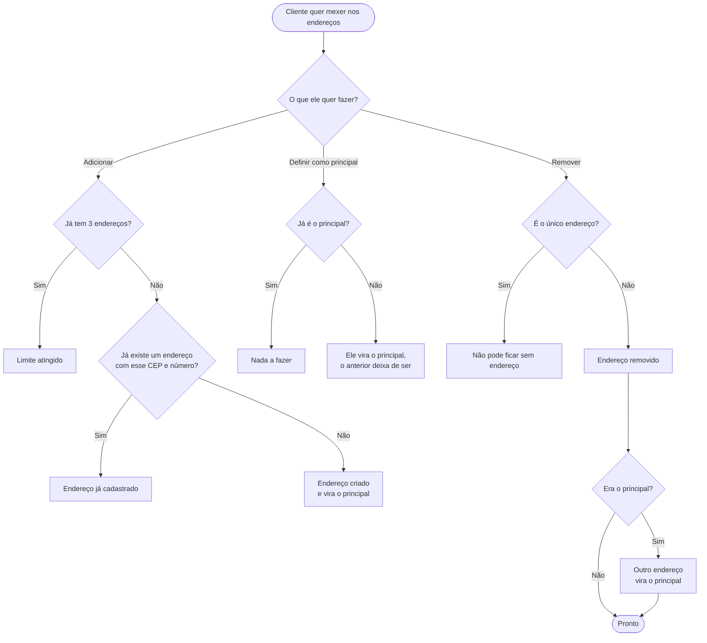

[← Voltar ao índice](./README.md)

# Minha conta

**Em uma frase:** o cliente gerencia seu nome e seus endereços de entrega, e pode excluir a conta — sem que isso apague o histórico de vendas do bar.

## Endereços

## As regras dos endereços

**Até três endereços por cliente.** Casa, trabalho, casa de alguém. O limite existe para manter a tela de escolha simples.

**Sempre existe exatamente um endereço principal.** É para onde o pedido vai. Um endereço novo entra automaticamente como principal — o comportamento esperado de quem acabou de cadastrar onde está agora.

**Não dá para ficar sem nenhum endereço.** O último não pode ser removido. Se a pessoa quer trocar de endereço, ela cadastra o novo e remove o antigo.

**Remover o principal promove outro.** A conta nunca fica num estado sem endereço de entrega definido.

**Não dá para cadastrar o mesmo endereço duas vezes.** A comparação leva em conta o CEP e o número.

## Excluir a conta

**A exclusão preserva o histórico do bar.** Os pedidos que a pessoa fez continuam existindo para o bar — são registro de venda, o bar precisa deles para contabilidade e para entender seu próprio negócio. O que acontece é que os **dados pessoais são apagados**: nome, telefone e endereços somem, e a conta é desativada. Os pedidos passam a não apontar mais para uma pessoa identificável.

**Não dá para excluir com pedido em andamento.** Enquanto houver um pedido aguardando, em preparo ou a caminho, a conta não pode ser excluída. Seria deixar o bar com uma entrega para fazer e ninguém para receber.

**A exclusão é definitiva.** Não há como recuperar. Se a pessoa voltar depois com o mesmo telefone, ela cria uma conta nova, do zero, sem o histórico anterior.

## Quando não dá certo

| Situação | O que a pessoa vê |
|---|---|
| Tentou cadastrar um quarto endereço | *"Limite de endereços atingido."* |
| Cadastrou um endereço que já tinha | *"Endereço já cadastrado."* |
| Tentou remover o único endereço | *"Não é possível remover o único endereço cadastrado."* |
| Marcou como principal um endereço que já era | *"Endereço já é o principal"* |
| Tentou excluir a conta com pedido em andamento | *"Não é possível excluir a conta pois você tem pedidos em andamento."* |
| Tentou completar o cadastro que já estava completo | *"Dados do cliente já inicializados"* |
| Salvou o perfil sem mudar nada | *"Nenhum campo para atualizar"* |

---

**Relacionados:** [entrar e criar conta](./entrar-e-criar-conta.md) · [o pedido](./pedido.md)
