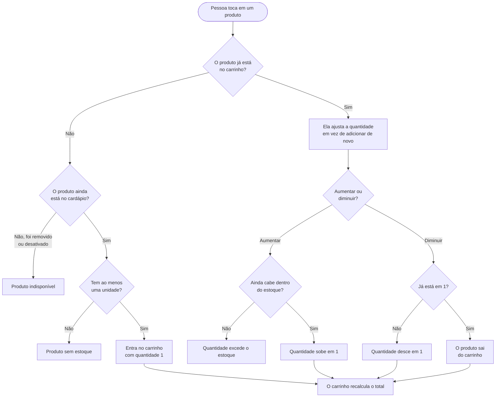

[← Voltar ao índice](./README.md)

# Montar o carrinho

**Em uma frase:** qualquer pessoa, com conta ou sem, escolhe produtos do cardápio e ajusta as quantidades — o sistema vai conferindo se o produto ainda existe e se ainda tem estoque.

## O caminho

## As regras

**Um produto entra uma vez só.** Não existem duas linhas do mesmo item no carrinho. Tocar em "adicionar" de novo não duplica nada — a partir daí a pessoa mexe na quantidade.

**Diminuir a quantidade até o fim remove o item.** Quando está em uma unidade e a pessoa diminui, o produto simplesmente sai do carrinho. É o comportamento que ela espera, e evita ficar com um item "zerado" ocupando espaço na tela.

**O app avisa quando o estoque está acabando.** Se restam 10 unidades ou menos, ele mostra quantas sobraram — é uma informação útil e cria senso de urgência. Acima disso, não mostra número nenhum: quanto o bar tem em estoque não é informação do cliente.

**Produto desativado ou removido não entra.** E se o bar remover um produto que já estava no carrinho de alguém, ele sai dos carrinhos automaticamente.

**O total é mostrado em partes.** A pessoa vê o subtotal (só os produtos), a taxa de entrega e o desconto do cupom em linhas separadas, e só então o total. Isso evita a sensação de preço escondido.

**Pode existir um valor mínimo de pedido.** Quando o bar configura um, o carrinho mostra quanto falta para atingi-lo. O valor mínimo não impede montar o carrinho — ele só é cobrado na hora de fechar o pedido.

**O carrinho não expira.** Ele fica lá até a pessoa esvaziar ou fechar o pedido. Só há uma exceção importante: ao entrar na conta, o carrinho montado sem login substitui o que estava salvo na conta (explicado em [entrar e criar conta](./entrar-e-criar-conta.md)).

## Quando não dá certo

| Situação | O que a pessoa vê |
|---|---|
| Adicionar um produto que já está no carrinho | *"Produto já existe no carrinho"* |
| O produto foi desativado enquanto ela navegava | *"Produto não está mais disponível"* |
| Adicionar um produto que zerou o estoque | *"Produto sem estoque disponível"* |
| Aumentar a quantidade além do que existe em estoque | *"Quantidade solicitada excede o estoque disponível"* |
| Mexer em um produto que não está mais no carrinho | *"Produto não existe no carrinho"* |
| O produto foi removido do cardápio | *"Produto não encontrado"* |

---

**Próximos passos:** aplicar um [cupom de desconto](./cupons.md) ou seguir direto para [fechar o pedido](./pedido.md).
