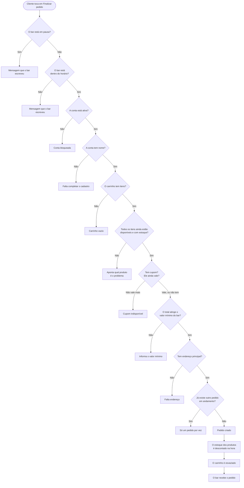
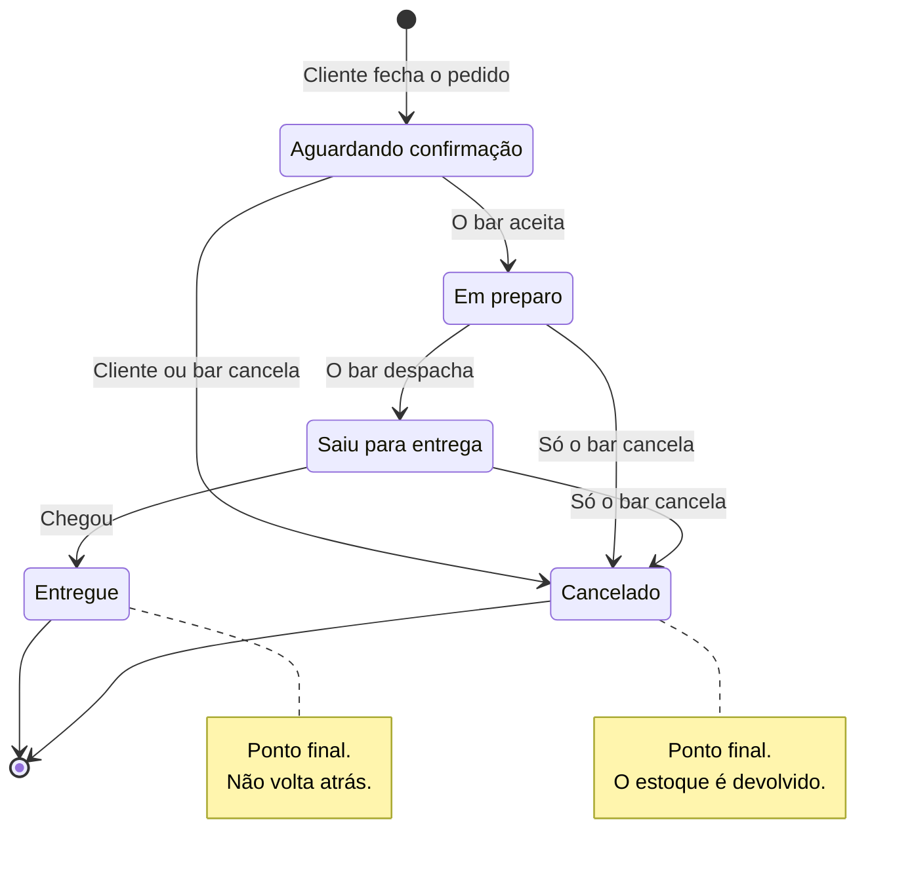

[← Voltar ao índice](./README.md)

# O pedido

**Em uma frase:** fechar o pedido é o momento em que o carrinho vira compromisso — o sistema confere tudo de novo, reserva o estoque, e a partir daí o pedido caminha por etapas até a entrega.

## Fechar o pedido

Antes de aceitar, o sistema passa por uma lista de conferências. Elas acontecem nesta ordem, e a primeira que falhar interrompe tudo.

## As regras de fechamento

**Um pedido em andamento por vez.** Enquanto o pedido anterior não for entregue ou cancelado, o cliente não consegue fazer outro. É uma decisão de operação: o bar não quer dois pedidos simultâneos da mesma pessoa chegando na cozinha.

**O bar precisa estar aberto.** Existem dois jeitos de estar fechado — fora do horário de funcionamento, ou em pausa (por exemplo, cozinha sobrecarregada num sábado à noite). Em ambos os casos, **a mensagem que o cliente vê é escrita pelo próprio bar**, na tela de configurações. Por isso ela pode explicar o motivo e o horário de volta.

**A conta precisa estar completa e ativa.** Sem nome cadastrado, não dá para fechar. E uma conta bloqueada pelo bar também não consegue pedir.

**Precisa haver um endereço principal.** É para onde o pedido vai. O cliente pode ter até três endereços, mas um deles é sempre o principal.

**Pode haver um valor mínimo de pedido.** O bar configura, e a mensagem de erro informa o valor exato exigido. O cálculo usa o total final: produtos, mais a taxa de entrega, menos o desconto.

**O estoque é descontado no momento do pedido, não na entrega.** Assim que o pedido é criado, aquelas unidades saem do estoque. Isso evita que duas pessoas comprem a última garrafa ao mesmo tempo. Se alguém tiver pegado a última unidade entre o cliente montar o carrinho e apertar "finalizar", o pedido é recusado e o app diz qual produto é o problema.

**O pedido guarda uma fotografia dos produtos.** Nome, preço e imagem são copiados no momento da compra. Se o bar aumentar o preço da cerveja amanhã, o pedido de hoje continua mostrando o preço de hoje. O mesmo vale para o código do cupom usado.

## Depois de fechado: as etapas

**O pedido nunca volta para trás.** Um pedido em preparo não retorna para "aguardando". Se o bar errou a etapa, o caminho é cancelar e refazer.

**Quem pode cancelar, e quando.** O cliente só cancela enquanto o pedido está aguardando confirmação — depois que a cozinha começou a preparar, não dá mais. O bar pode cancelar em qualquer momento antes da entrega.

**Cancelar devolve tudo.** O estoque dos produtos volta para o cardápio, e se havia cupom, o uso é liberado — o cliente pode usar aquele cupom em um pedido futuro.

**O bar guarda o histórico de estoque.** Toda entrada e saída de estoque fica registrada com o motivo: um pedido criado, um pedido cancelado, uma reposição feita pelo bar. Nada muda de quantidade sem deixar rastro.

## Quando não dá certo

| Situação | O que a pessoa vê |
|---|---|
| O bar está em pausa ou fora do horário | A mensagem que o próprio bar escreveu nas configurações |
| Já tem um pedido em andamento | *"Você já tem um pedido em andamento."* |
| O carrinho está vazio | *"O carrinho está vazio"* |
| A conta não tem nome cadastrado | *"Cliente não inicializado"* |
| A conta foi bloqueada pelo bar | *"Sua conta foi bloqueada. Por favor, entre em contato com o suporte."* |
| Não tem endereço principal | *"Nenhum endereço principal cadastrado."* |
| O total não atinge o mínimo | *"O valor mínimo para realizar um pedido é de R$ 30,00."* (com o valor real) |
| Um produto do carrinho foi desativado | *"Cerveja Pilsen não está mais disponível. Remova o produto para finalizar o pedido."* |
| Um produto zerou o estoque | *"Cerveja Pilsen está sem estoque no momento. Remova o produto para finalizar o pedido."* |
| Restam menos unidades do que ela quer | *"Cerveja Pilsen tem apenas 3 unidades restantes."* |
| Tentou cancelar um pedido que já está em preparo | *"Este pedido não pode mais ser cancelado."* |
| O cupom esgotou entre aplicar e finalizar | *"Este cupom atingiu o limite de uso"* |

> As mensagens de estoque citam o nome do produto e a quantidade real. É de propósito: dizer só "sem estoque" obrigaria o cliente a caçar qual dos itens é o culpado.

---

**Relacionados:** [montar o carrinho](./montar-carrinho.md) · [cupons](./cupons.md) · [gestão do bar](./gestao-do-bar.md)
